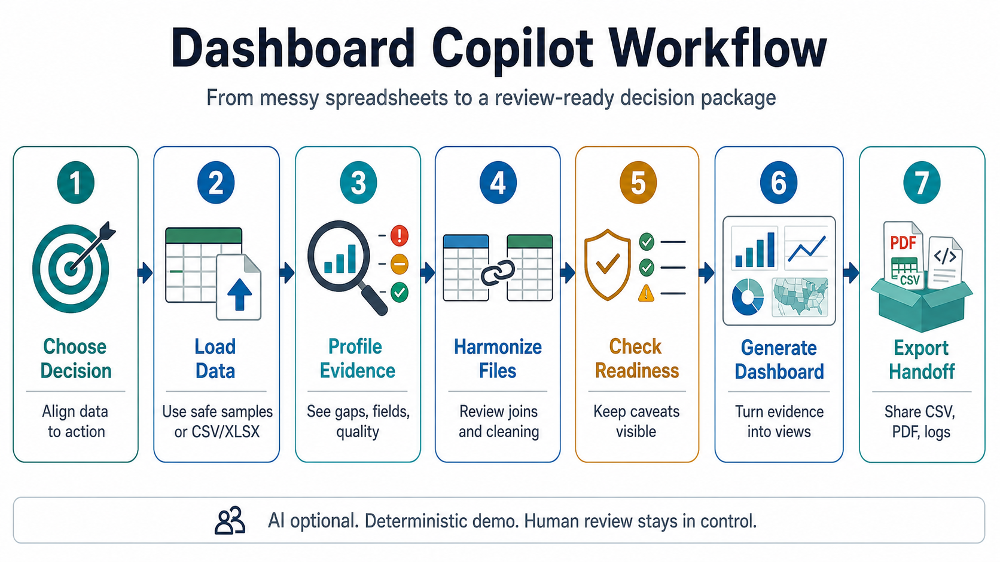
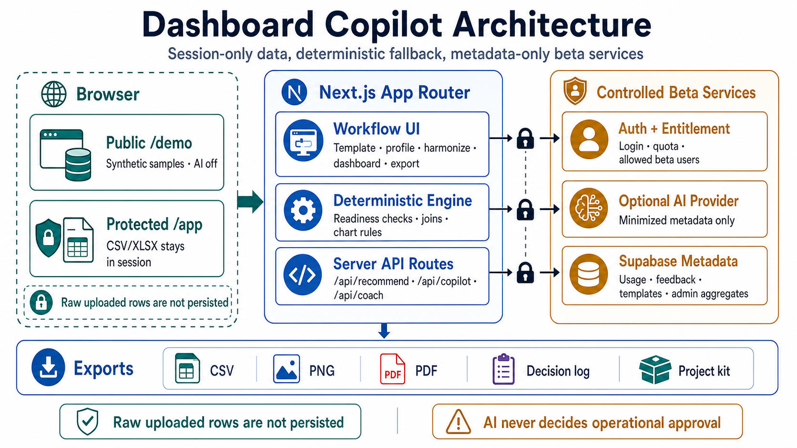

# Dashboard Copilot

Turn messy disaster-response spreadsheets into a reviewable decision-support package.

[Try the public demo on Vercel](https://disaster-dashboard-webapp-repo-git-codex-dash-fd18aa-charnrit-k.vercel.app/demo) · [Run it locally](#run-locally) · [Read the public-good guide](docs/digital-public-good-guide.md)

No login required. The public demo uses synthetic sample data and keeps AI off.

Dashboard Copilot helps humanitarian and public-good teams start from the decision they need to make, check whether their data can support it, prepare fragmented CSV/XLSX files safely, and export a dashboard-ready handoff with caveats still visible.

It is not an automated operational approval system. The product is a controlled-beta decision-support workflow: useful for demos, review, adaptation, and safe stakeholder handoff; not a substitute for analysts, domain leads, or accountability processes.

## At A Glance





## Why Try It

- Starts with a response decision, not a blank chart canvas.
- Uses synthetic sample data in the public preview so you can explore without uploading sensitive files.
- Profiles multiple files and shows which fields support each evidence need.
- Recommends safe joins, cleaning steps, dashboard views, and readiness caveats.
- Exports reviewable CSV, PNG, PDF, transformation log, decision handoff, and project-kit outputs.

## 3-Minute Product Tour

Open the [public Vercel demo](https://disaster-dashboard-webapp-repo-git-codex-dash-fd18aa-charnrit-k.vercel.app/demo), then:

1. Choose the response prioritization template.
2. Review the suggested data collection fields.
3. Load the fragmented demo data.
4. Profile the data and inspect evidence coverage.
5. Harmonize the files, review the recommendation, and accept it.
6. Generate the dashboard and export the handoff package.

The fastest way to understand the product is to watch how the app handles incomplete or risky data: it keeps caveats visible instead of hiding weak evidence behind polished charts.

## Who This Is For

- Information management officers and humanitarian analysts.
- Response coordinators preparing operational updates.
- DataKind and civic-technology teams adapting decision-support workflows.
- Reviewers evaluating a public-good, privacy-preserving dashboard prototype.

## What Is Safe To Expect

The public preview is for orientation and deterministic demo use. Authenticated AI remains controlled-beta only. Uploaded disaster data remains session-only in the app contract. Persistent storage is limited to approved metadata in the controlled beta, and production deployment, production database migration, admin access policy, provider/model changes, and retention automation remain explicit approval gates.

## Project Documentation

Start with these documents if you are reviewing, submitting, or adapting the project:

- [Digital Public Good Guide](docs/digital-public-good-guide.md): plain-English overview, scope, extension guidance, starter prompts, and technical appendix.
- [AI Mode Configuration](docs/AI_MODE.md): server-side AI setup, route behavior, task-specific model variables, and deterministic fallback.
- [Data Retention Draft](docs/data-retention.md): metadata retention boundaries and automation gate.
- [Release Readiness Checklist](docs/release-readiness.md): controlled-beta launch gates, rollback, and safety checks.
- [Build Guard](docs/build-guard.md): guarded `npm run build` behavior, hard timeouts, and stuck-process cleanup rules.
- [Visualization Policy](docs/visualization-policy.md): deterministic chart, map, denominator, caveat, and accessibility guardrails.
- [Codex Starter Prompts](docs/codex-starter-prompts.md): copy-ready prompts for adapting the project to new decision-support contexts.
- [Showcase Script](docs/showcase-script.md): short demo path for explaining the workflow to a non-technical audience.
- [Repo-local Codex Skills](docs/copilot/): skills for visualization standards, bootstrapping another decision-support app, and adapting decision templates.
- [Controlled-Beta Handoff v1.1](plan/dashboard_copilot_codex_handoff_v1_1/README.md): active controlled-beta execution package, task history, QA evidence, and remaining gates.
- [Plan Archive](plan/archive/README.md): historical prompt packs and design-kit artifacts retained only for traceability.

## Run Locally

Use Node.js `24.15.0` as pinned in `.tool-versions`, then install from the
lockfile:

```bash
npm ci
npm run dev
```

Open `http://localhost:3000`.

Run verification:

```bash
npm run lint
npm run test
npm run build
```

`npm run build` is guarded against forever-waiting Next build processes. Tune
local timeout behavior with `NEXT_BUILD_TIMEOUT_MS` only when a slow machine
needs more time.

## Controlled-Beta Contract And Current Status

Production v1 is a controlled authenticated AI beta with session-only uploaded data. Response prioritization is the approved primary workflow. Service gap monitoring and preparedness risk screening are beta workflows until a domain reviewer approves their use.

Deterministic mode is the default launch posture. AI may be enabled only after the server verifies authentication, entitlement, and the daily quota. The demo path remains onboarding and proof, not the definition of production readiness.

Persistent storage is allowed only for account/profile metadata, AI usage, AI events, feedback, custom templates, template versions, and non-sensitive eval metadata. Uploaded files, uploaded rows, prepared rows, full datasets, exported reports/files, full LLM request bodies, full prompts, API keys, service-role keys, private tokens, and sensitive operational data must not be persisted.

Current status as of 2026-06-29: the public demo is appropriate for sharing as
a deterministic, synthetic-sample preview. Supabase-backed magic-link login has
been user-confirmed for controlled-beta testing, and production remains
untouched. Production launch remains blocked until product, domain,
safety/privacy, export, accessibility, release, and support owners are named and
their gates are closed or explicitly deferred.

## Configuration

Upload limits and supported file types live in `lib/config.ts`.

Unset `LLM_ENABLED` and `NEXT_PUBLIC_COPILOT_API_ENABLED` values default to deterministic mode. Set both to `true` and provide `LLM_API_KEY` only after AI mode is intentionally approved for the target environment.

Copy `.env.example` to `.env.local` for local development. The checked-in example defaults to deterministic-safe mode with `LLM_ENABLED=false` and `NEXT_PUBLIC_COPILOT_API_ENABLED=false`; set both to enabled values and provide `LLM_API_KEY` only when you want server-side OpenAI calls enabled.

Optional server-side runtime variables:

```bash
LLM_ENABLED=false
# Set one provider key only when enabling LLM calls.
# Do not set LLM_API_KEY to an empty value; it takes precedence over OPENAI_API_KEY.
# LLM_API_KEY=sk-...
# OPENAI_API_KEY=sk-...
LLM_PROVIDER=openai
LLM_MODEL=gpt-5.4-mini
LLM_WORKFLOW_MODEL=gpt-5.4-mini
LLM_DASHBOARD_MODEL=gpt-5.5
LLM_QUALITY_GUIDANCE_MODEL=gpt-5.4-mini
LLM_HANDOFF_MODEL=gpt-5.5
LLM_REQUEST_TIMEOUT_MS=15000
LLM_WORKFLOW_REQUEST_TIMEOUT_MS=15000
LLM_DASHBOARD_REQUEST_TIMEOUT_MS=45000
LLM_HANDOFF_REQUEST_TIMEOUT_MS=30000
LLM_MAX_COMPLETION_TOKENS=3200
AI_DAILY_QUOTA=20
MAX_UPLOAD_SIZE_MB=10
RECOMMEND_REQUEST_MAX_BYTES=200000
RECOMMEND_RATE_LIMIT_MAX_REQUESTS=20
RECOMMEND_RATE_LIMIT_WINDOW_MS=60000
RECOMMEND_MAX_PROFILES=4
RECOMMEND_MAX_COLUMNS_PER_PROFILE=80
RECOMMEND_MAX_SAMPLE_VALUES_PER_COLUMN=5
RECOMMEND_MAX_STRING_LENGTH=240
RECOMMEND_MAX_DASHBOARD_FACTS=14
RECOMMEND_MAX_SUMMARY_ITEMS=8
```

Browser-exposed/static-build variable:

```bash
NEXT_PUBLIC_COPILOT_API_ENABLED=false
```

The browser never reads `LLM_API_KEY`, `OPENAI_API_KEY`, `DATABASE_URL`, `AUTH_SECRET`, or `SUPABASE_SECRET_KEY`. `NEXT_PUBLIC_COPILOT_API_ENABLED` is the browser-exposed AI switch. If the recommendation route cannot call an LLM, if `LLM_ENABLED` is unset or `false`, if the user is unauthenticated, or if quota is exhausted, the app falls back to deterministic recommendations. Static Codex Sites builds should keep `NEXT_PUBLIC_COPILOT_API_ENABLED=false` so the browser uses deterministic in-page recommendations instead of calling unavailable API routes.

AI copilot calls are routed server-side by task. Workflow harmonization and quality repair guidance default to the mini model because those tasks are bounded and schema-heavy. Dashboard synthesis and decision handoff summaries default to the full-size model because they require more judgment across readiness, caveats, and stakeholder-facing narrative. `LLM_MODEL` is still supported as a backward-compatible fallback when a task-specific model variable is omitted; task-specific variables take precedence.

`LLM_MAX_COMPLETION_TOKENS` controls the Responses API output-token budget for workflow harmonization, quality guidance, dashboard synthesis, and handoff summaries. Increase it if the app reports that the model response was truncated before the structured JSON finished.

`/api/recommend` and `/api/copilot` include anonymous/IP-bucket request limits as a safety limiter before auth is resolved. Provider-backed AI still requires authentication, entitlement, quota, server-side enablement, and a server-side key. By default, each client IP bucket can make 20 recommendation or copilot requests per 60 seconds. Set `RECOMMEND_RATE_LIMIT_MAX_REQUESTS=0` to disable the in-memory limiter. For production deployments with multiple server instances, pair these settings with a hosting firewall or edge rate limit.

When LLM recommendations are on, the app sends minimized dataset profile metadata to the configured provider. This includes column names, inferred types, missingness, unique counts, and capped column sample values. Full uploaded rows are not sent to the LLM recommendation or handoff routes.

## Current Controlled-Beta Scope

- CSV and XLSX upload validation with a 10 MB per-file default limit.
- Bundled multi-dataset sample with needs assessment, population baseline, join coverage, trend, demographic, and quality-review signals.
- Decision templates for response prioritization plus beta service gap monitoring and preparedness risk screening workflows.
- Deterministic profiling, join recommendations, dashboard recommendations, combined preparation/quality checks, and scoped preparation transformation logging.
- Vercel-compatible `/api/recommend` and `/api/copilot` routes with an auth/entitlement gate abstraction, configurable request limits, daily AI quota checks, and deterministic fallback.
- Workflow export page for CSV, PNG, PDF report, scoped transformation log JSON, review-ready decision handoff exports, and a dependency-free project kit JSON.
- Vitest coverage for the core parsing, profiling, joining, dashboard, and recommendation-schema logic.
- Session-only upload and prepared-data handling; authenticated app, metadata-only persistence, feedback/templates, quota-aware coach, and admin aggregate reporting are implemented for controlled-beta validation. Production deployment and production database migration remain separate explicit approvals.
